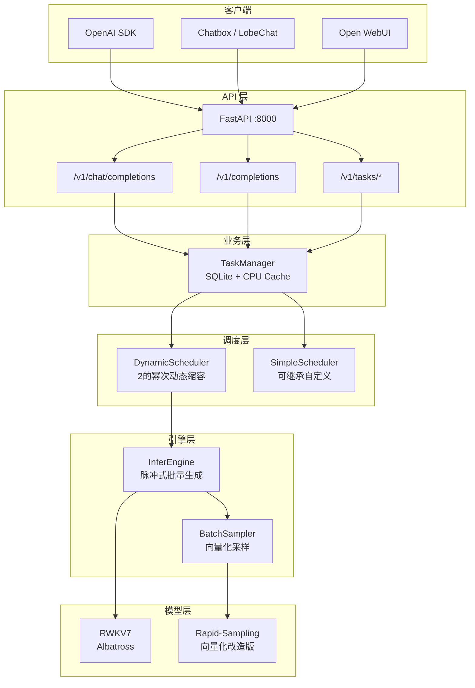
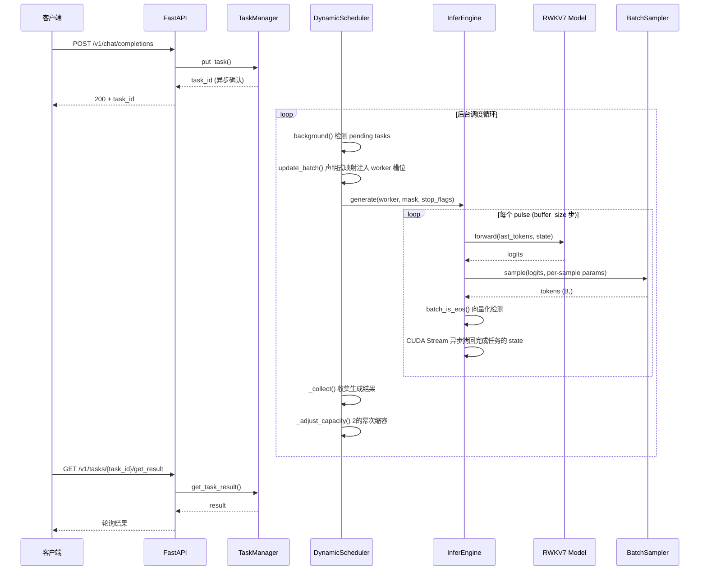
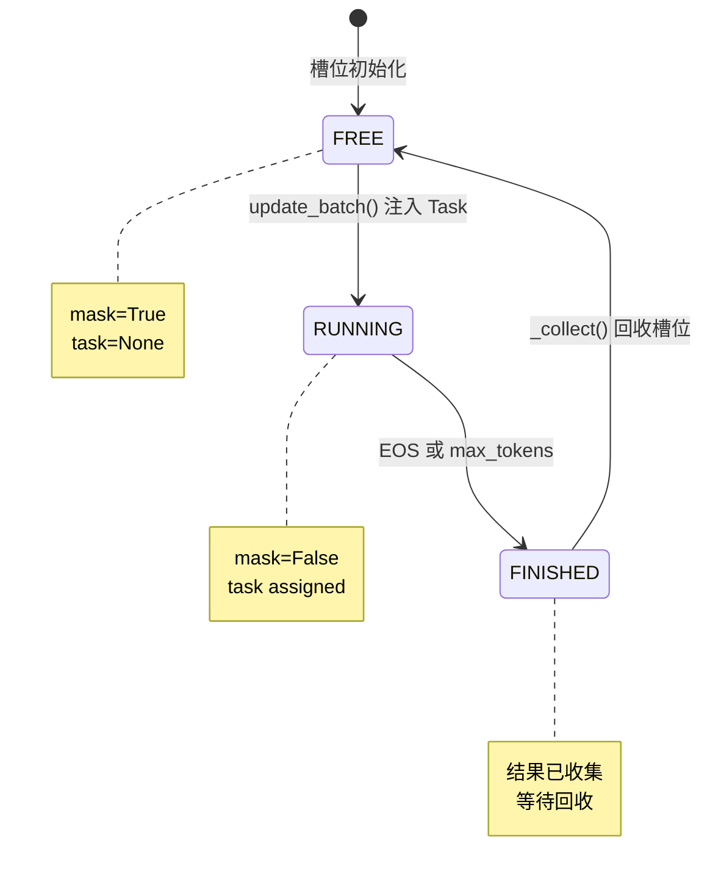
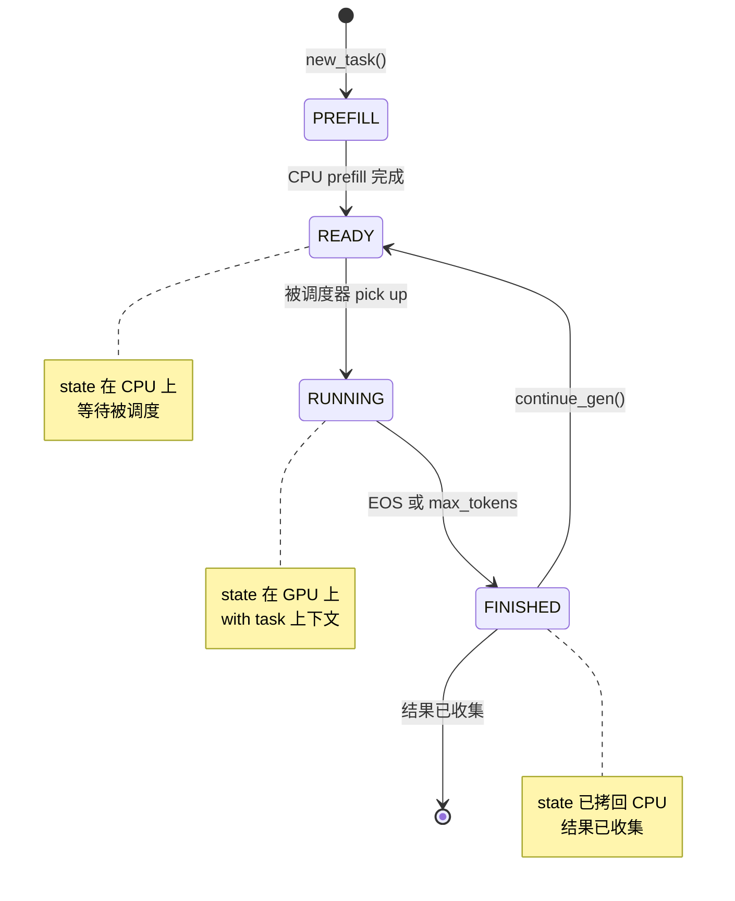
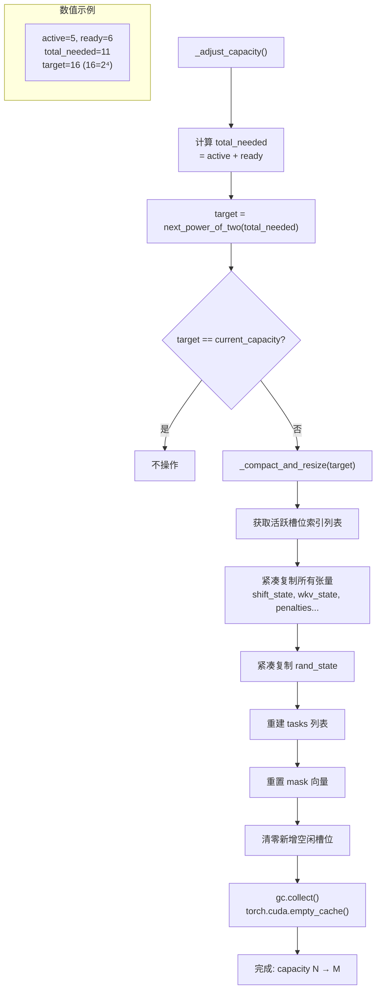

# RWKV-Server

<p align="center">
  <strong>RWKV 线性注意力批量推理服务器 —— 用户无感自入队</strong>
</p>

<p align="center">
  <em>提交请求，即刻享受 RWKV 线性注意力批量推理的高效与便利。</em>
</p>

<p align="center">
  
  
  
  
  
</p>

---

## 📊 性能表现

| 配置 | 峰值吞吐 | 全程平均 | 显存 |
|---|---|---|---|
| **2.9B · RTX 4090** | **11,081 tok/s** | 4,126 tok/s | 9.0 GB |
| 2.9B · 5070 Ti Laptop | 5,169 tok/s | 1,973 tok/s | 9.0 GB |
| 7.2B · RTX 4090 | 6,373 tok/s | 2,483 tok/s | 17.1 GB |

<details>
<summary><b>展开查看详细测试数据</b></summary>


### RWKV7 2.9B · RTX 4090（24GB）

批量压力测试：256 个长 prompt 任务并发，`max_tokens=2000`，temperature=1.0，buffer_size=32。

| 指标 | 数值 |
|---|---|
| **峰值吞吐** | **11,081 tok/s**（256 并发满载） |
| 全程平均吞吐 | 4,126 tok/s |
| 单任务速度（256 并发） | ~43 tok/s |
| 单任务速度（低并发） | ~80 tok/s |
| 总耗时 | 137.75s（254 任务 × 平均 ~2,158 token 输出） |
| 显存占用 | 9.0 GB（模型 6.5GB + 256 任务 state ~2.5GB） |

```
 RWKV 推 理 压 力 测 试
 模型: 2.9B · 显卡: RTX 4090 · 任务数: 256 · 显存: 23.5 GB
────────────────────────────────────────────────
 输入 tokens:  20,140       输出 tokens:  548,180
 总吞吐量:     4,126 tok/s  输出吞吐:     3,980 tok/s
 平均每任务输出: 2,158 tokens
────────────────────────────────────────────────
 峰值: Iter 11 cap=256 active=256 speed=11081.09 tok/s per_task=43.29 tok/s
```

### RWKV7 2.9B · RTX 5070 Ti Laptop（12GB）

批量压力测试：256 个长 prompt 任务并发，`max_tokens=2000`，temperature=1.0，buffer_size=32。

| 指标 | 数值 |
|---|---|
| **峰值吞吐** | **5,169 tok/s**（256 并发满载） |
| 全程平均吞吐 | 1,973 tok/s |
| 单任务速度（256 并发） | ~20 tok/s |
| 单任务速度（低并发） | ~55-80 tok/s |
| 总耗时 | 286s（256 任务 × 平均 ~2,147 token 输出） |
| 显存占用 | 9.0 GB（模型 6.5GB + 256 任务 state ~2.5GB） |

```
 RWKV 推 理 压 力 测 试
 模型: 2.9B · 显卡: RTX 5070 Ti Laptop GPU · 任务数: 256 · 显存: 9.0 GB
────────────────────────────────────────────────
 输入 tokens:  20,140       输出 tokens:  545,440
 总吞吐量:     1,973 tok/s  输出吞吐:     1,903 tok/s
 平均每任务输出: 2,147 tokens
────────────────────────────────────────────────
 峰值: Iter 2 cap=256 active=256 speed=5168.75 tok/s per_task=20.19 tok/s
```

### RWKV7 7.2B · RTX 4090（24GB）

批量压力测试：256 个长 prompt 任务并发，`max_tokens=2000`，temperature=1.0，buffer_size=32。

| 指标 | 数值 |
|---|---|
| **峰值吞吐** | **6,373 tok/s**（256 并发满载） |
| 全程平均吞吐 | 2,483 tok/s |
| 单任务速度（256 并发） | ~24.5 tok/s |
| 单任务速度（低并发） | ~59 tok/s |
| 总耗时 | 251.43s（254 任务 × 平均 ~2,378 token 输出） |
| 显存占用 | 17.1 GB（模型 ~13.5GB + 256 任务 state ~3.6GB） |

```
 RWKV 推 理 压 力 测 试
 模型: 7.2B · 显卡: RTX 4090 · 任务数: 256 · 显存: 23.5 GB
────────────────────────────────────────────────
 输入 tokens:  20,140       输出 tokens:  604,139
 总吞吐量:     2,483 tok/s  输出吞吐:     2,403 tok/s
 平均每任务输出: 2,378 tokens
────────────────────────────────────────────────
 峰值: Iter 2 cap=256 active=256 speed=6373.59 tok/s per_task=25.51 tok/s
```

> 7.2B 模型比 2.9B 峰值吞吐高 23%，得益于 4090 的算力余量（82.6 TFLOPS FP16）。动态缩容过程：256→128→64→32→16→8→4→2→1，每次紧凑迁移 < 15ms。

---

项目提供了 [Locust](https://locust.io/) 压力测试脚本，默认使用 `/v1/tasks/tmp` 接口（临时任务自动清理），支持 Web UI 和无头模式：

```bash
# Web UI 模式（浏览器动态调整并发）
locust -f test/locustfile.py --host=http://localhost:8000

# 无头模式：256 并发，每秒 +10，持续 10 分钟
locust -f test/locustfile.py --host=http://localhost:8000 --headless \
  -u 256 -r 10 --run-time 10m --csv=perf_report
```

脚本会自动记录首包延迟 TTFT、流式总耗时等关键指标。

---

</details>

## 📖 目录

- [✨ 核心特性](#-核心特性)
- [🧠 什么是 RWKV-Server？](#-什么是-rwkv-server)
- [🏗️ 架构概览](#️-架构概览)
- [📡 使用方法](#-使用方法)
  - [OpenAI 兼容 API](#openai-兼容-api)
  - [🎭 Few-Shot 对话模板](#-few-shot-对话模板)
  - [📋 模板任务（Template Tasks）](#-模板任务template-tasks)
  - [🔌 LLM 门户接入](#-llm-门户接入)
  - [🔧 私有 API（任务管理）](#-私有-api任务管理)
  - [🧩 直接调用调度器（Python SDK）](#-直接调用调度器python-sdk)
- [🚀 快速开始](#-快速开始)
- [🔬 架构深度解析](#-架构深度解析)
  - [请求-推理完整数据流](#请求-推理完整数据流)
  - [调度器 Worker 槽位状态机](#调度器-worker-槽位状态机)
  - [Task 生命周期](#task-生命周期)
  - [2的幂次动态缩容决策流程](#2的幂次动态缩容决策流程)
- [⚙️ 配置说明](#️-配置说明)
- [📁 项目结构](#-项目结构)
- [🙏 参考与致谢](#-参考与致谢)
- [🤝 贡献指南](#-贡献指南)
- [⭐ Star History](#-star-history)

---

## ✨ 核心特性

| | | |
|---|---|---|
| 🚀 **自入队批量推理** | 提交即走，调度器自动攒批，无需手动管理 batch |
| 📐 **2的幂次动态缩容** | 任务少时释放显存，多时自动扩容，最大化 GPU 利用率 |
| ⚡ **CUDA Stream 异步零阻塞** | state 拷回不阻塞推理流水线 |
| 🔌 **OpenAI 兼容 API** | 无缝接入 Chatbox、LobeChat、Open WebUI 等生态 |
| 🎯 **Per-sample 向量化采样** | 批次内每个样本独立 temperature / top_k / top_p |
| 📋 **提示词模板持久化** | 好用的提示词 prefill 一次，之后 fork 即用，零重复开销 |
| 🌊 **流式输出 SSE** | 实时推送生成内容，首 token 延迟极低 |
| 📊 **统一日志格式** | uvicorn / starlette 日志自动转发，格式一致 |

---

## 🧠 什么是 RWKV-Server？

**RWKV（Receptance Weighted Key Value）** 是一种结合线性注意力与 Transformer 优势的架构。与 Transformer 的 O(n²) 注意力不同，RWKV 推理复杂度为 **O(1)**——只需维护一个固定大小的隐藏状态（state），每个 token 的计算量恒定。

这一特性让 **批量推理** 成为 RWKV 的强项：多个请求的 state 可在 GPU 上天然并行。batch 越大，GPU 利用率越高，吞吐量近乎线性增长。

RWKV-Server 围绕三个原则构建：

1. **零感知** — 你不需要关心 batch 何时攒满、state 如何管理。提交 prompt，服务端自动完成一切。
2. **高吞吐** — 利用线性注意力特点，动态攒批 + 脉冲式生成，逼近 GPU 算力上限。
3. **弹性伸缩** — 根据负载自动调整 batch 容量（1→2→4→8→...→256），空闲时释放显存。

| | 传统 LLM 服务 | RWKV-Server |
|---|---|---|
| 推理复杂度 | O(n²) 注意力 | O(1) 线性注意力 |
| 批量机制 | Continuous Batching | 状态复用 + 脉冲并行 |
| 用户感知 | 需管理 batch / queue | 完全无感，提交即走 |
| 显存 | KV Cache 随上下文线性增长 | 固定 state 大小，可预测 |
| 容量管理 | 静态 batch size | 2的幂次动态缩容 |

---

## 🏗️ 架构概览



| 模块 | 核心职责 |
|---|---|
| **模型加载器** `loader.py` | 加载 RWKV7 模型、tokenize、向量化 EOS 检测 |
| **调度器基类** `scheduler_base.py` | Worker 槽位管理、声明式参数映射、批量收集 |
| **动态调度器** `scheduler_dynamic.py` | 2的幂次动态扩缩容、紧凑迁移 |
| **简化调度器** `scheduler_simple.py` | 最小实现，供继承自定义 |
| **推理引擎** `batch_engine.py` | 脉冲式批量生成、CUDA Stream 异步拷回 |
| **批量采样器** `batch_sampler.py` | 向量化采样，per-sample 独立参数 |
| **OpenAI API** `routes/v1/openai/` | `/v1/chat/completions` + `/v1/completions` |
| **任务管理** `task/task.py` + `task/manager.py` | Task 生命周期、上下文管理器、SQLite 持久化、LRU 缓存 |
| **私有任务 API** `routes/v1/rwkv/` | 9 个任务 CRUD 端点 |

---

## 📡 使用方法

### OpenAI 兼容 API

RWKV-Server 兼容 OpenAI Chat Completion 和 Completion 接口：

**Chat Completion：**

```bash
curl http://localhost:8000/v1/chat/completions \
  -H "Content-Type: application/json" \
  -d '{
    "model": "rwkv-7",
    "messages": [
      {"role": "system", "content": "你是一个友好的AI助手。"},
      {"role": "user", "content": "什么是光合作用？"}
    ],
    "temperature": 0.7,
    "top_p": 0.9,
    "top_k": 50,
    "max_tokens": 500,
    "presence_penalty": 2.0,
    "stream": false
  }'
```

**流式输出（SSE）：**

```bash
curl http://localhost:8000/v1/chat/completions \
  -H "Content-Type: application/json" \
  -d '{
    "model": "rwkv-7",
    "messages": [{"role": "user", "content": "讲个笑话"}],
    "stream": true
  }'
```

Python 客户端：

```python
from openai import OpenAI

client = OpenAI(
    base_url="http://localhost:8000/v1",
    api_key="sk-local",
)

# 非流式
response = client.chat.completions.create(
    model="rwkv-7",
    messages=[{"role": "user", "content": "你好！"}],
    temperature=0.7,
    max_tokens=500,
)
print(response.choices[0].message.content)

# 流式
stream = client.chat.completions.create(
    model="rwkv-7",
    messages=[{"role": "user", "content": "讲个笑话"}],
    stream=True,
)
for chunk in stream:
    if chunk.choices[0].delta.content:
        print(chunk.choices[0].delta.content, end="", flush=True)
```

RWKV 原生支持 **`System:` 角色**，OpenAI API 中的 `system` 消息会被转换为 `System: {content}` 前缀：

```python
response = client.chat.completions.create(
    model="rwkv-7",
    messages=[
        {"role": "system", "content": "你是一个专业的技术翻译，请将英文翻译为中文。"},
        {"role": "user", "content": "LLMs use multi-head self-attention to process tokens in parallel."},
    ],
)
# 实际 prompt：
# System: 你是一个专业的技术翻译...
#
# User: LLMs use multi-head self-attention...
#
# Assistant:  thinking
#  response
```

与直接拼文本不同，`System:` 标签让模型明确区分系统指令和用户对话，对角色扮演 / 风格约束 / 安全护栏等场景尤其有效。

### 🎭 Few-Shot 对话模板

`few_shot.txt` 提供了 **30+ 个**对话示例，覆盖知识问答、编程、翻译、数学、创意写作等场景。每个示例都包含推理过程：

```
User: 什么是光合作用？

Assistant:  <think>用户问了一个基础生物学概念。我需要给出清晰、准确的定义，并解释其重要性。</think>
光合作用是植物、藻类和一些细菌利用光能，将二氧化碳和水转化为有机物（如葡萄糖）并释放氧气的过程。简单说，
就是植物"吃饭"和"呼吸"的方式，为生态系统提供能量和氧气。
<|endoftext|>
```

`few_shot.txt` 中**prompt 适合加入 prefill 实现提示词工程调优**：纯概念问答题要求先给定义再补充功能，编程题要求选择最标准的方法并附完整代码，翻译题要求直接给出最准确的对应表达，数学题要求展示每一步计算过程。所有这些引导都写在 `think` 标签里，让模型在回答前进行**隐式链式思考（Implicit CoT）**，显著提升回答质量。

你可以按此格式自由扩展 `few-shot.txt`，添加你自己的场景模板。

### 📋 模板任务（Template Tasks）—— 提示词工程

如果你有一个特别好用的提示词，每次请求都要用它，常规做法是每次带在 prompt 里——这意味着每次都从头 prefill，浪费算力。

RWKV-Server 的做法是：**把提示词做成模板，prefill 一次，永久复用。**

核心技巧：**`max_tokens=0`**。设为 0 时，调度器只做 prefill（构建 state），不生成任何内容。prefill 完成后，这个模板的 state 就绪，后续 fork 出的实例直接从这个 state 开始推理，省去重复 prefill。

```python
from server import RWKV070ModelLoader, DynamicScheduler
from server.task.manager import get_task_manager

pipeline = RWKV070ModelLoader("model.pth")
scheduler = DynamicScheduler(pipeline)
scheduler.start_daemon()
task_manager = get_task_manager()

# 创建翻译模板：max_tokens=0，只 prefill 不生成
template_task = scheduler.new_task(
    prompt="User: 你是一个专业的中英技术翻译，请翻译以下内容。\n\n",
    max_tokens=0,  # 关键：只 prefill
    temperature=0.3,
)
scheduler.run()  # prefill 完成，state 已就绪
task_manager.put_task("_tech_translator", template_task)

# 每次使用时 fork，state 自动继承，零 prefill 开销
new_id = task_manager.fork_template("_tech_translator")
task = task_manager.get_task(new_id)
task.continue_gen(
    "请翻译：The transformer architecture revolutionized NLP.",
    max_tokens=500,
)
scheduler.add_task(task)
```

以 `_` 开头的任务 ID 被视为只读模板，不受容量限制淘汰，不会被覆盖。模板存储在 SQLite 中，重启服务后依然可用。

**预设多个角色：**

实际场景肯定不止这一点点提示词，fork可节省大量重复的prefill，甚至于让agent在某个环节分支然后并行。

```python
roles = {
    "_coder":       "User: 你是一个资深的 Python 后端工程师。\n\nAssistant: 好的。\n\n",
    "_translator":  "User: 你是一个专业的中英技术翻译。\n\nAssistant: 明白。\n\n",
    "_writer":      "User: 你是一个创意故事作家。\n\nAssistant: 好的，让我们开始。\n\n",
}

for role_id, prompt in roles.items():
    task = scheduler.new_task(prompt=prompt, max_tokens=0)
    scheduler.run()
    task_manager.put_task(role_id, task)

# 随时 fork 使用
coding_task_id = task_manager.fork_template("_coder")
```

### 🔌 LLM 门户接入

RWKV-Server 兼容 OpenAI API 标准，可接入主流 LLM 客户端：

**Chatbox / LobeChat / Open WebUI：**
- API 地址：`http://localhost:8000/v1`
- API Key：任意值（如 `sk-local`）
- 模型名称：`rwkv-7`

### 🔧 私有 API（任务管理）

除了 OpenAI 兼容接口，RWKV-Server 还提供了一套更底层的任务管理 API，适合需要精细控制的场景。

| 端点 | 方法 | 说明 |
|---|---|---|
| `/v1/tasks/tmp` | `POST` | 临时任务：提交 prompt，可选 stream，结果不持久化 |
| `/v1/tasks/create` | `POST` | 创建持久化任务，支持 `stream` 参数 |
| `/v1/tasks/{task_id}/get_result` | `GET` | 轮询获取任务结果 |
| `/v1/tasks/{task_id}/fork` | `POST` | Fork 模板并继续生成 |
| `/v1/tasks/{task_id}/continue` | `POST` | 对已有任务追加 prompt 并继续生成 |
| `/v1/tasks/{task_id}/stop` | `POST` | 停止正在生成的任务 |
| `/v1/tasks/{task_id}/as_template` | `POST` | 将一个已完成的任务转为持久化模板 |
| `/v1/tasks/{task_id}/delete` | `POST` | 删除任务（模板需 `force=true`） |
| `/v1/tasks/fim` | `POST` | Fill In Middle：给定 prefix/suffix，生成中间内容 |
| `/v1/tasks/list` | `GET` | 列出所有活跃任务 |

#### 临时任务

临时任务与持久化任务共用同一套参数，区别是 task_id 以 `TMP_` 开头，便于识别和管理。同样支持 `stream` 参数：

```bash
# 流式模式：SSE 实时推送
curl -X POST http://localhost:8000/v1/tasks/tmp \
  -H "Content-Type: application/json" \
  -d '{
    "prompt": "User: 用一句话介绍线性注意力。\n\nAssistant:",
    "max_tokens": 100,
    "temperature": 0.7,
    "stream": true
  }'

# 非流式模式：仅创建任务，返回 task_id，后续轮询获取结果
curl -X POST http://localhost:8000/v1/tasks/tmp \
  -H "Content-Type: application/json" \
  -d '{
    "prompt": "User: 用一句话介绍线性注意力。\n\nAssistant:",
    "max_tokens": 100,
    "temperature": 0.7,
    "top_p": 0.3,
    "top_k": 50,
    "stream": false
  }'
```

非流式模式返回（仅确认创建，结果需轮询）：

```json
{
  "task_id": "TMP_abc123def456",
  "result": "",
  "prefill_time": 0.012,
  "gen_time": 0,
  "speed": 0,
  "finished": false
}
```

#### 创建持久化任务

任务会被存入 SQLite，支持后续轮询、继续生成、转为模板。

```bash
# 非流式：返回 task_id，稍后轮询获取结果
curl -X POST http://localhost:8000/v1/tasks/create \
  -H "Content-Type: application/json" \
  -d '{
    "prompt": "User: 写一个 Python 二分查找。\n\nAssistant:",
    "max_tokens": 500,
    "temperature": 0.3,
    "stream": false
  }'

# 流式：SSE 实时推送 token
curl -X POST http://localhost:8000/v1/tasks/create \
  -H "Content-Type: application/json" \
  -d '{
    "prompt": "User: 讲一个关于程序员的笑话。\n\nAssistant:",
    "max_tokens": 200,
    "temperature": 0.8,
    "stream": true
  }'
```

#### 轮询结果

```bash
curl http://localhost:8000/v1/tasks/TASK_abc123/get_result
```

返回已生成的内容片段。当 `finished: true` 时表示生成完成。

#### Fork + Continue

配合模板任务使用——Fork 出一个副本，追加新 prompt 继续生成：

```bash
# Fork 模板并继续：从模板 state 出发，prefill 追加内容后继续生成
curl -X POST http://localhost:8000/v1/tasks/_my_template/fork \
  -H "Content-Type: application/json" \
  -d '{
    "prompt": "User: 请翻译：Hello World\n\nAssistant:",
    "max_tokens": 200,
    "temperature": 0.3,
    "stream": true
  }'
```

对已有任务追加 prompt 继续生成：

```bash
curl -X POST http://localhost:8000/v1/tasks/TASK_abc123/continue \
  -H "Content-Type: application/json" \
  -d '{
    "prompt": "再补充一个递归版本的实现。\n\n",
    "max_tokens": 500,
    "stream": true
  }'
```

#### 任务管理

```bash
# 将完成的任务转为模板
curl -X POST http://localhost:8000/v1/tasks/TASK_abc123/as_template

# 停止正在生成的任务
curl -X POST http://localhost:8000/v1/tasks/TASK_abc123/stop

# 删除任务
curl -X POST http://localhost:8000/v1/tasks/TASK_abc123/delete

# 查看所有活跃任务
curl http://localhost:8000/v1/tasks/list
```


#### Fill In Middle（FIM）

FIM（Fill In Middle）适用于代码补全、文本填充等场景——给定光标前后的文本，模型生成中间缺失的部分。与 rwkv_lightning 使用相同的 prompt 构造格式。

```bash
# 代码补全示例
curl -X POST http://localhost:8000/v1/tasks/fim   -H "Content-Type: application/json"   -d '{
    "prefix": "def hello_world():\n    print(",
    "suffix": ")\n    return True",
    "max_tokens": 50,
    "temperature": 0.8,
    "stream": false
  }'
```

参数说明：

| 参数 | 类型 | 必填 | 说明 |
|---|---|---|---|
| `prefix` | `string` | 是 | 光标前的文本 |
| `suffix` | `string` | 否 | 光标后的文本，默认空 |
| `max_tokens` | `int` | 否 | 最大生成 token 数，默认 2000 |
| `temperature` | `float` | 否 | 采样温度 |
| `stream` | `bool` | 否 | 是否流式输出 |

FIM 支持流式和非流式两种模式，行为与普通任务 API 一致。非流式返回 task_id，通过轮询获取结果；流式通过 SSE 实时推送。

---

### 🧩 直接调用调度器（Python SDK）

如果你不想走 HTTP API，可以直接 import 调度器嵌入到自己的 Python 应用中。这也是 `test.py` 压力测试脚本使用的方式——**零网络开销，直接操作 state**。

> 适合：批量离线推理、自定义 pipeline、嵌入上游 agent 框架、不想起 HTTP 服务的场景。

#### 最简示例

```python
from server import RWKV070ModelLoader, DynamicScheduler
from server.config import settings

# 1. 加载模型
loader = RWKV070ModelLoader(settings.model_path, settings.vocab_path)

# 2. 创建调度器
scheduler = DynamicScheduler(
    loader,
    max_batch_size=256,   # 最大并发
    buffer_size=32,       # 每个 pulse 生成的 token 数
)

# 3. 提交任务
tasks = [
    scheduler.new_task(
        f"User: {prompt}\n\nAssistant:",
        max_tokens=200,
        temperature=0.7,
        top_p=0.3,
        top_k=50,
    )
    for prompt in ["你好，介绍一下你自己", "用 Python 写一个快速排序", "1+1等于几？"]
]

# 4. 运行（阻塞，直到所有任务完成）
scheduler.run()

# 5. 获取结果
for task in tasks:
    print(f"[{task.task_id}] {task.decode(task.pop_tokens())[:200]}...")
```

`run()` 是阻塞调用，内部循环直到所有任务状态变为 `FINISHED`，返回后即可取结果。最简单的用法就是上面 5 步。

#### 关键类与参数

**`RWKV070ModelLoader(model_path, vocab_path=None)`**

加载模型和词表：

```python
loader = RWKV070ModelLoader("models/rwkv7-2.9b.pth", "eof_v20230424.txt")

# 常用方法
loader.encode("你好")                # str → list[int]
loader.decode([123, 456])            # list[int] → str
loader.gen_state(batch_size=1)       # 生成初始 state（用于 fork 多个 task）
```

**`DynamicScheduler(loader, max_batch_size, buffer_size)`**

动态调度器，支持 2 的幂次自动扩缩容。另有 `SimpleScheduler` 继承基类不加任何逻辑，供自定义调度策略。

**`scheduler.new_task(prompt, ...)` → `Task`**

创建一个新的推理任务。完整参数：

| 参数 | 类型 | 默认 | 说明 |
|---|---|---|---|
| `prompt` | `str \| list[int]` | 必填 | 输入文本（字符串）或已编码的 token 列表 |
| `max_tokens` | `int` | `50` | 最大生成 token 数。设为 `0` 则只 prefill 不生成（模板模式） |
| `temperature` | `float` | `0.3` | 采样温度，越高越随机 |
| `top_p` | `float` | `0.1` | Nucleus 采样阈值 |
| `top_k` | `int` | `20` | Top-K 采样 |
| `presence_penalty` | `float` | `0.0` | 存在惩罚，鼓励生成新 token |
| `repetition_penalty` | `float` | `0.0` | 重复惩罚 |
| `penalty_decay` | `float` | `0.0` | 惩罚衰减系数 |
| `seed` | `int` | `42` | 随机种子（确定性输出） |
| `collect_callback` | `callable` | `None` | 每次 pulse 生成后回调，参数为 `tokens: list[int]` |
| `finish_callback` | `callable` | `None` | 任务完成时回调，参数为 `all_tokens: list[int]` |

注意：请勿在回调中添加过于耗时的操作！最佳实践为回调收集后在另外线程处理。

**`scheduler.add_task(prompt, ...)` → `None`**

外部添加任务（已创建好的 Task 对象）

**`Task` 对象**

创建后自动完成 prefill（CPU 上），state 保持在 CPU 等待调度：

| 属性 / 方法 | 说明 |
|---|---|
| `task_id` | 默认 `"TMP"` |
| `status` | `PREFILL` → `READY` → `RUNNING` → `FINISHED` |
| `current_token` | 当前输入 token（prefill 后为 prompt 最后一个 token） |
| `pop_tokens()` | 取出并清空已收集的生成 token |
| `decode(tokens)` | 将 token 列表解码为文本 |
| `stop()` | 停止推理（外部中断） |
| `continue_gen()` | 将已完成任务重置为 READY，继续生成 |

#### 回调模式

适合流式输出或增量处理场景——不等 `run()` 全部完成就能拿到中间结果：

```python
def on_tokens(tokens):
    """每次 pulse 生成 buffer_size 个 token 后回调"""
    text = loader.decode(tokens)
    print(text, end="", flush=True)

def on_finish(all_tokens):
    """任务完成回调"""
    print(f"\n--- 完成，共 {len(all_tokens)} tokens ---")

task = scheduler.new_task(
    "User: 写一首关于春天的诗\n\nAssistant:",
    max_tokens=300,
    temperature=0.8,
    collect_callback=on_tokens,   # 每个 pulse 回调
    finish_callback=on_finish,    # 完成时回调
)
scheduler.run()
```

#### 模板任务（max_tokens=0 + TaskManager）

回调模式适合在线场景，但更高效的用法是利用 `max_tokens=0` 做模板持久化，配合 `TaskManager` 管理 state 生命周期：

```python
from server import RWKV070ModelLoader, DynamicScheduler
from server.task.manager import get_task_manager
from server.config import settings

loader = RWKV070ModelLoader(settings.model_path, settings.vocab_path)
scheduler = DynamicScheduler(loader, 256, 32)
task_manager = get_task_manager()
task_manager.set_dependencies(loader, scheduler.sampler)

# Step 1: 创建模板 —— max_tokens=0，只 prefill 不生成
tpl = scheduler.new_task(
    "User: 你是一个资深 Python 后端工程师，请遵循 PEP8 规范。\n\nAssistant: 好的。\n\n",
    max_tokens=0,
    temperature=0.3,
)
scheduler.run()  # prefill 完成，state 在 CPU

# Step 2: 存入 TaskManager（SQLite 持久化）
task_manager.put_task("_coder", tpl)

# Step 3: 使用时 fork —— state 自动继承，零 prefill 开销
for question in ["写一个线程安全的单例", "如何优化数据库连接池？", "解释 GIL 及其影响"]:
    new_id = task_manager.fork_template("_coder")
    task = task_manager.get_task(new_id)
    task.continue_gen()  # 重置状态为 READY
    task.prefill(f"User: {question}\n\nAssistant:")  # 追加新 prompt
    task.max_tokens = 500
    scheduler.add_task(task)

scheduler.run()  # 3 个任务并行推理，共享同一份系统提示词 prefill
```

**`TaskManager` 常用方法：**

| 方法 | 说明 |
|---|---|
| `put_task(task_id, obj)` | 存入缓存（以 `_` 开头的 ID 视为只读模板） |
| `get_task(task_id)` → Task | 从缓存或 SQLite 取出 |
| `fork_template(template_id)` → new_id | Fork 模板，state 自动拷贝 |
| `close_task(task_id)` | 关闭并写入 DB |
| `delete_task_from_any_level(task_id, force=False)` | 删除任务 |

> **模板 ID 以 `_` 开头被视为只读**，不受 LRU 淘汰、不会被覆盖，重启后仍在 SQLite 中。

#### 后台常驻模式

如果需要持续接收任务而不阻塞当前线程：

```python
# 启动后台线程
scheduler.start_daemon()  # 内部循环：有任务就 run()，空闲 sleep 0.5s

# 随时提交新任务
task = scheduler.new_task("User: 你好\n\nAssistant:", max_tokens=100)
# 调度器自动发现 READY 任务并开始推理

# 优雅关闭
scheduler.shutdown()
```

#### FIM 示例：代码补全

```python
# FIM 本质是 prompt 构造，两行即可
prompt = f"✿prefix✿✿suffix✿{suffix}✿middle✿{prefix}"
task = scheduler.new_task(prompt, max_tokens=100, temperature=0.8)
scheduler.run()
print(loader.decode(task.pop_tokens()))
```

#### 完整示例：翻译服务

```python
from server import RWKV070ModelLoader, DynamicScheduler
from server.config import settings

loader = RWKV070ModelLoader(settings.model_path, settings.vocab_path)
scheduler = DynamicScheduler(loader, max_batch_size=64, buffer_size=32)

def translate(texts: list[str], source_lang="中文", target_lang="英文"):
    tasks = [
        scheduler.new_task(
            f"User: 将以下{source_lang}翻译为{target_lang}：{t}\n\nAssistant:",
            max_tokens=300,
            temperature=0.3,
            top_p=0.3,
        )
        for t in texts
    ]
    scheduler.run()
    return [loader.decode(t.pop_tokens()) for t in tasks]

# 使用
results = translate(["你好世界", "机器学习很有趣", "今天天气真好"])
for r in results:
    print(r)
```

关于更详细的sdk，请详见代码实现，大部分函数有较详细文档。

---

## 🚀 快速开始

### Python SDK —— 优雅调用 RWKV 推理

推荐使用官方 SDK，无需关心批量调度、状态管理、GPU 显存分配——只需创建一个 `Task`，RWKV-Server 会在后台自动完成一切。

```bash
pip install rwkv-api
```

```python
from rwkv_api import Client

client = Client("http://localhost:8000")

# 创建任务并等待结果 —— 服务端自动批量调度
task = client.create("Hello world", max_tokens=50)
result = task.wait()
print(result.result)

# 实时流式输出
for chunk in client.create_stream("Tell me a story", max_tokens=200):
    print(chunk, end="", flush=True)
```

SDK 提供同步/异步双客户端、Task 对象生命周期管理、FIM 代码补全、异常处理等完整功能。详见 [RWKV-API SDK 文档](https://github.com/AUXStar/RWKV-API)。

### 环境要求

- **Python** >= 3.13
- **PyTorch** >= cu130（RTX 50 系列 Blackwell GPU / CUDA 12.x 工具链）
- **操作系统**：Linux / Windows

不同模型的显存需求与建议并发数（以 RTX 4090 24GB 为例）：

| 模型 | 模型权重 | 剩余可用 | 建议 `MAX_BATCH_SIZE` |
|------|----------|----------|----------------------|
| RWKV7 2.9B | ~6 GB | ~16 GB | **256** |
| RWKV7 7.2B | ~14.4 GB | ~8 GB | **256**（每个任务约 11MB state） |

> 7.2B 模型加载后剩余约 8GB，理论支持 700+ 并发，但实际场景几乎不可能同时来那么多请求——256 足够日常使用。

### Step 1：下载模型

从 HuggingFace 下载 RWKV7 模型，放到 `server/model/` 目录下：

```bash
# 例如
mkdir -p server/model
# 将下载的 .pth 文件放入 server/model/
```

### Step 2：克隆仓库

```bash
git clone --recurse-submodules https://github.com/AUXStar/RWKV-Server.git
cd RWKV-Server
```

### Step 3：安装依赖

项目使用 [uv](https://github.com/astral-sh/uv) 管理依赖：

```bash
uv sync
```

### Step 4：启动服务

```bash
# Windows PowerShell
$env:RWKV_MODEL_PATH = "server/model/rwkv7-g1g-7.2b-20260523-ctx8192.pth"
python run.py

# Linux / macOS
export RWKV_MODEL_PATH="server/model/rwkv7-g1g-7.2b-20260523-ctx8192.pth"
python run.py
```

不想设环境变量？所有默认值在 `server/config.py` 里，改完直接 `python run.py`。

服务启动后终端会输出类似日志：

```
12:01:23.45 | INFO    | scheduler.dynamic  | Init capacity = 1 (max=256)
12:01:23.56 | INFO    | api                | Uvicorn running on http://0.0.0.0:8000
```

### Step 5：发送第一个请求

```bash
curl http://localhost:8000/v1/chat/completions \
  -H "Content-Type: application/json" \
  -d '{
    "model": "rwkv-7",
    "messages": [
      {"role": "user", "content": "用 Python 写一个快速排序"}
    ],
    "temperature": 0.7,
    "max_tokens": 500
  }'
```

返回：

```json
{
  "id": "chatcmpl-xxx",
  "object": "chat.completion",
  "model": "rwkv-7",
  "choices": [{
    "index": 0,
    "message": {
      "role": "assistant",
      "content": "以下是 Python 快速排序的实现：\n\n```python\ndef quicksort(arr):\n    ..."
    },
    "finish_reason": "stop"
  }]
}
```

---

## 🔬 架构深度解析

### 请求-推理完整数据流



### 调度器 Worker 槽位状态机



### Task 生命周期



### 2的幂次动态缩容决策流程



**为什么是 2 的幂次？**

1. **GPU 显存对齐**：许多 CUDA 操作在 2 的幂次对齐时性能最优
2. **状态向量效率**：`shift_state` 的 shape 为 `(B, 2, L, D)`，B 为 2 的幂次时内存布局更优
3. **减少碎片化**：频繁小幅度扩缩容会导致 GPU 显存碎片，幂次跳跃减少了扩容频率
4. **弹性范围大**：从 1 到 256，只需 9 个容量级别，管理简洁

---

## ⚙️ 配置说明

所有配置通过环境变量 `RWKV_` 前缀设置，遵循 [12-Factor App](https://12factor.net/config) 原则。不想设环境变量的话，也可以直接改 `server/config.py` 里的默认值，改完直接 `python run.py`。

| 环境变量 | 默认值 | 说明 |
|---|---|---|
| `RWKV_MODEL_PATH` | `server/model/rwkv7-g1g-2.9b-20260526-ctx8192.pth` | 模型文件路径 |
| `RWKV_MAX_BATCH_SIZE` | `256` | 最大批量推理数（2的幂次上限） |
| `RWKV_BUFFER_SIZE` | `32` | 脉冲步数（每个 pulse 生成的 token 数） |
| `RWKV_DEFAULT_MAX_TOKENS` | `2000` | 默认最大生成 token 数 |
| `RWKV_DEFAULT_TEMPERATURE` | `1.0` | 默认采样温度 |
| `RWKV_DEFAULT_TOP_P` | `0.3` | 默认 top-p 值 |
| `RWKV_DEFAULT_TOP_K` | `50` | 默认 top-k 值 |
| `RWKV_DEFAULT_PRESENCE_PENALTY` | `2.0` | 默认存在惩罚（鼓励多样性） |
| `RWKV_DEFAULT_REPETITION_PENALTY` | `0` | 默认重复惩罚 |
| `RWKV_DEFAULT_PENALTY_DECAY` | `1.0` | 默认惩罚衰减系数 |
| `RWKV_VERBOSE` | `true` | 是否启用 INFO 级别日志 |
| `RWKV_VOCAB_PATH` | `server/eof_v20230424.txt` | 词表文件路径 |
| `RWKV_TASK_DEFAULT_CPU_CAPACITY` | `300` | CPU 缓存最大任务数 |
| `RWKV_TASK_DB_MAX_SIZE` | `10000` | SQLite 最大非模板任务数 |
| `RWKV_TASK_ASYNC_QUEUE_SIZE` | `200` | 异步写 DB 队列大小 |
| `RWKV_TASK_DB_PATH` | `rwkv_tasks.db` | SQLite 数据库路径 |

### 调优建议

- **BUFFER_SIZE**：越大单次 pulse 生成 token 越多，但高负载下 GPU 显存压力更大。建议范围 16-64
- **MAX_BATCH_SIZE**：根据显存调整。2.9B 模型建议 256，7.2B 模型建议 256
- **PRESENCE_PENALTY**：值越高越鼓励多样性，创意写作建议 2.0+，代码生成建议 0.5-1.0

---

## 📁 项目结构

```
RWKV-Server/
├── run.py                           # 启动入口：create_app → uvicorn.run
├── test.py                          # 压力测试（直接调用调度器 API）
├── pyproject.toml                   # uv 项目配置
├── uv.lock                          # uv 依赖锁定文件
├── few_shot.txt                     # 30+ Few-shot 对话示例
├── eof_v20230424.txt                # 词表文件
├── server/
│   ├── __init__.py                  # 公共导出（RWKV070ModelLoader, *Scheduler）
│   ├── config.py                    # Pydantic Settings，环境变量 RWKV_ 前缀
│   ├── logger.py                    # Loguru 日志劫持 uvicorn / starlette
│   ├── utils.py                     # NullLock, stream_callback, finish_callback
│   ├── task/
│   │   ├── task.py                  # Task 类 + Status 枚举 + 上下文管理器
│   │   └── manager.py               # TaskManager（SQLite 持久化 + LRU CPU 缓存）
│   ├── scheduler/
│   │   ├── __init__.py              # CUDA 预热设置（cudnn benchmark, tf32）
│   │   ├── loader.py                # 模型加载 + 向量化 EOS 检测
│   │   ├── scheduler_base.py        # 基类调度器（field_mappings 映射表）
│   │   ├── scheduler_simple.py      # 简化版（可继承自定义）
│   │   ├── scheduler_dynamic.py     # 2的幂次动态扩缩容
│   │   ├── batch_engine.py          # 脉冲批量推理引擎（CUDA Stream 异步拷回）
│   │   └── batch_sampler.py         # 向量化批量采样器
│   ├── api/
│   │   ├── __init__.py
│   │   ├── app.py                   # FastAPI 应用 + lifespan → create_app()
│   │   ├── dependencies.py          # 依赖注入
│   │   └── routes/
│   │       └── v1/
│   │           ├── __init__.py      # 聚合 openai + rwkv 路由
│   │           ├── openai/
│   │           │   ├── __init__.py
│   │           │   ├── routers.py   # OpenAI 兼容 API 端点
│   │           │   ├── schemas.py   # 请求/响应 Pydantic 模型
│   │           │   └── utils.py     # 辅助函数
│   │           └── rwkv/
│   │               ├── __init__.py
│   │               ├── routers.py   # 私有任务 CRUD API 端点
│   │               └── schemas.py   # 请求/响应 Pydantic 模型
│   └── reference/
│       ├── __init__.py
│       ├── model_wrapper.py         # 模型包装器
│       ├── rwkv/                    # Git 子模块：Albatross RWKV7
│       └── sampler/                 # Git 子模块：Rapid-Sampling（向量化改造版）
├── test/
│   ├── locustfile.py                # Locust HTTP 压力测试脚本
│   ├── batch_async.py               # 异步批量测试
│   ├── batch_sync.py                # 同步批量测试
│   └── result/
│       └── log.txt                  # 测试结果日志
└── .gitmodules                      # Git 子模块配置
```

---

## 🙏 参考与致谢

本项目站在巨人的肩膀上，感谢以下优秀项目：

| 项目 | 说明 |
|---|---|
| [BlinkDL/Albatross](https://github.com/BlinkDL/Albatross) | RWKV7 官方模型实现，批量推理核心代码来源 |
| [RWKV-Vibe/rwkv_lightning](https://github.com/RWKV-Vibe/rwkv_lightning) | State Pool 设计借鉴，高效的线性注意力状态管理 |
| [AUXStar/Rapid-Sampling](https://github.com/AUXStar/Rapid-Sampling) | 批量采样器（向量化改造版），支持 per-sample 不同参数 |
| [Triang-jyed-driung/Rapid-Sampling](https://github.com/Triang-jyed-driung/Rapid-Sampling) | 原始 Rapid Sampling 算法 |

---

## 🤝 贡献指南

欢迎提交 Issue 和 Pull Request。在提交 PR 前，请确保：

1. 代码通过格式化检查
2. 新增功能包含测试用例
3. 更新相关文档

---

## ⭐ Star History

[](https://star-history.com/#AUXStar/RWKV-Server&Date)
